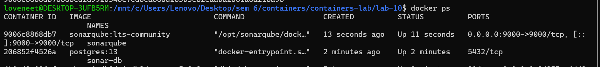
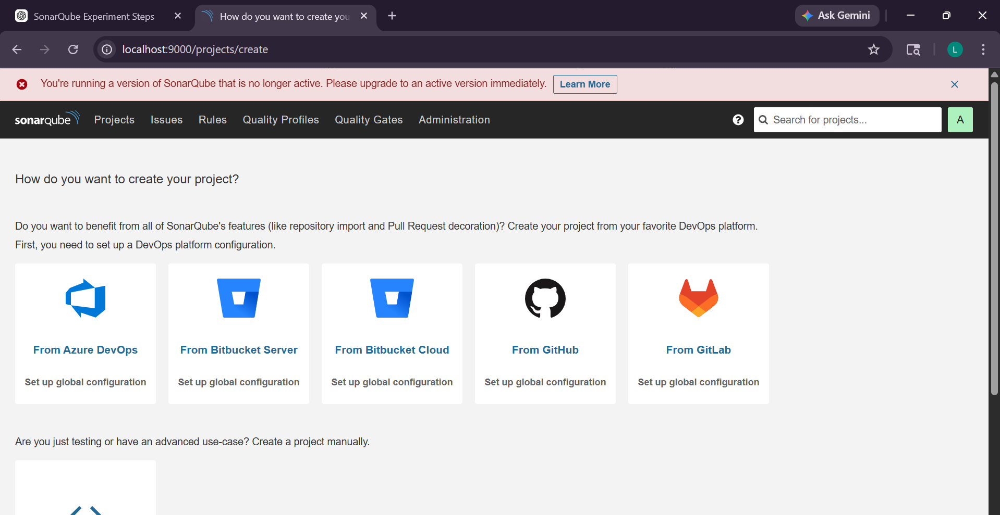
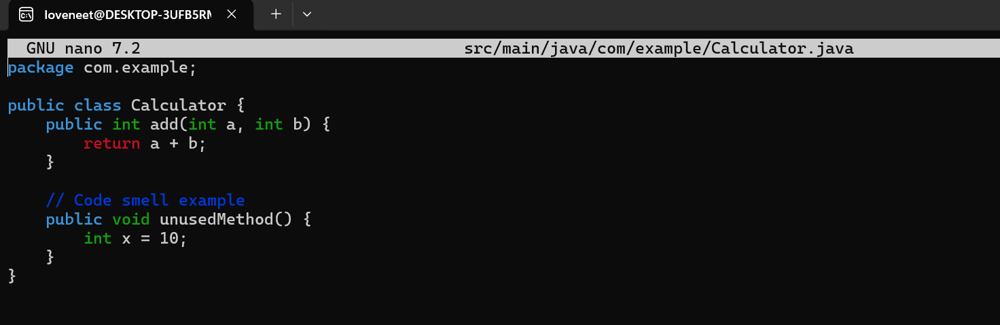
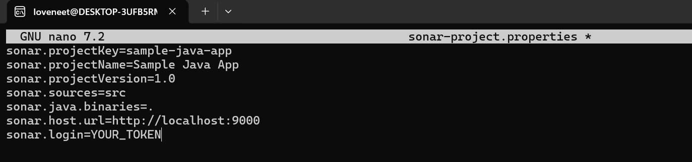
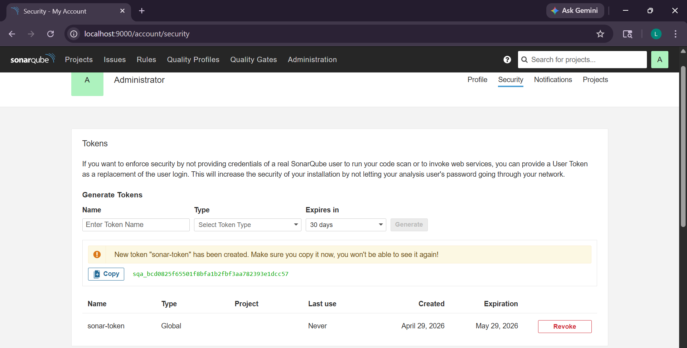
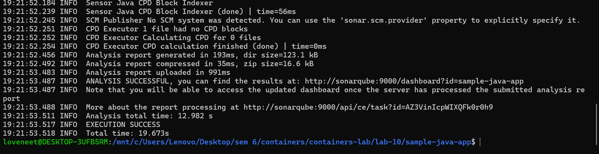
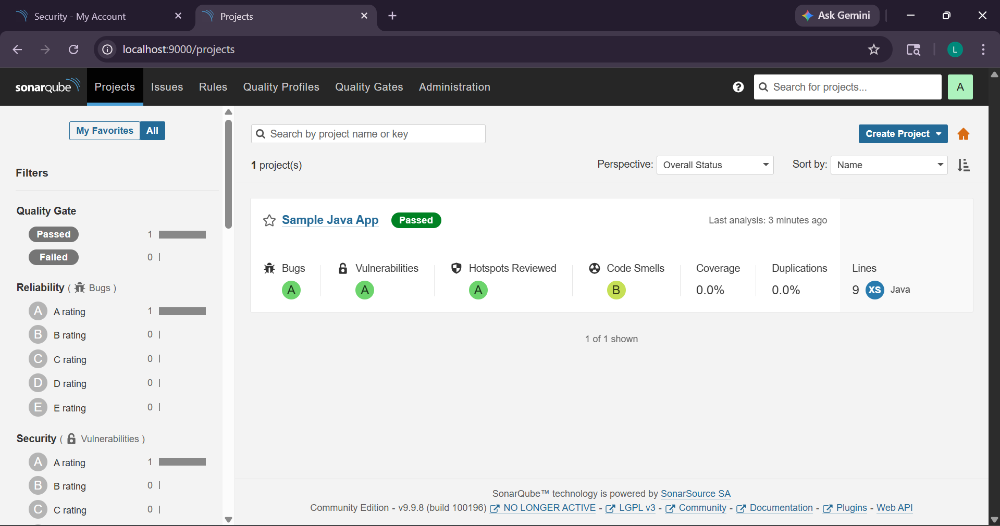

# Experiment 10: SonarQube Static Code Analysis

## Objective
To analyze code quality using SonarQube and identify bugs, vulnerabilities, and code smells.

---

## Step 1: Start Docker Containers

---

## Step 2: Open SonarQube Dashboard

---

## Step 3: Create Java App

---

## Step 4: Configure Sonar

---

## Step 5: Generate Token

---

## Step 6: Run Scanner

---

## Step 7: View Results

---

## Theory

SonarQube is a static code analysis tool used to inspect code quality. It detects bugs, vulnerabilities, and code smells in the source code. It supports multiple programming languages and integrates with CI/CD tools like Jenkins.

---

## Conclusion

In this experiment, SonarQube was successfully deployed using Docker and used to analyze a Java application. The tool identified code issues and provided a detailed report, helping improve code quality and maintainability.