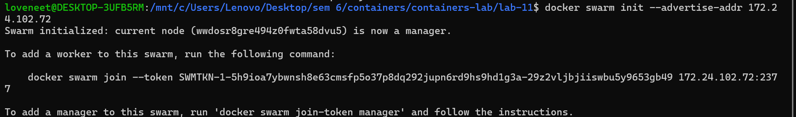
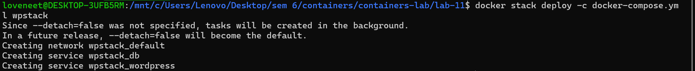
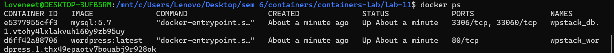
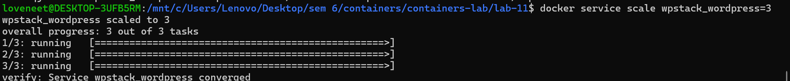
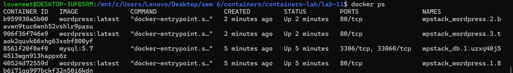
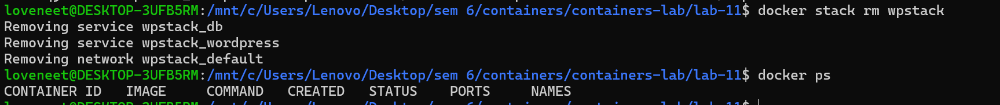

#  Experiment 11: Docker Compose & Docker Swarm (WordPress + MySQL)

---

##  Aim

To understand container orchestration using Docker Swarm by deploying a multi-container application (WordPress + MySQL), scaling services, and testing self-healing.

---

##  Theory

Docker Swarm is a container orchestration tool that allows managing multiple containers as services.

* ✔ Scaling (increase/decrease containers)
* ✔ Load Balancing
* ✔ Self-Healing (auto recovery)
* ✔ Service-based architecture

---

##  Prerequisites

* Docker installed
* Docker Compose file ready
* WSL / Linux environment

---

##  docker-compose.yml

```yaml
version: '3.8'

services:
  db:
    image: mysql:5.7
    environment:
      MYSQL_ROOT_PASSWORD: rootpass
      MYSQL_DATABASE: wordpress
      MYSQL_USER: wpuser
      MYSQL_PASSWORD: wppass
    volumes:
      - db_data:/var/lib/mysql

  wordpress:
    image: wordpress:latest
    ports:
      - "8080:80"
    environment:
      WORDPRESS_DB_HOST: db:3306
      WORDPRESS_DB_USER: wpuser
      WORDPRESS_DB_PASSWORD: wppass
      WORDPRESS_DB_NAME: wordpress
    depends_on:
      - db

volumes:
  db_data:
```

---

## 🔹 Step 1: Check Running Containers

```bash
docker ps
```

 Screenshot:


---

## 🔹 Step 2: Initialize Docker Swarm

```bash
docker swarm init --advertise-addr <your-ip>
```

 Screenshot:



---

## 🔹 Step 3: Verify Node

```bash
docker node ls
```

 Screenshot:


---

## 🔹 Step 4: Deploy Stack

```bash
docker stack deploy -c docker-compose.yml wpstack
```

 Screenshot:



---

## 🔹 Step 5: Check Services

```bash
docker service ls
```

 Screenshot:


---

## 🔹 Step 6: Check Containers

```bash
docker ps
```

 Screenshot:



---

## 🔹 Step 7: Access WordPress

Open in browser:

```
http://172.24.102.72:8080
```

 Screenshot:


---

## 🔹 Step 8: Scale WordPress

```bash
docker service scale wpstack_wordpress=3
```

 Screenshot:



---

## 🔹 Step 9: Verify Scaling

```bash
docker service ls
```

 Screenshot:


---

## 🔹 Step 10: Check Multiple Containers

```bash
docker ps
```

 Screenshot:



---

## 🔹 Step 11: Test Self-Healing

Kill a container:

```bash
docker kill <container_id>
```

Check again:

```bash
docker service ls
```

 Screenshots:


---

## 🔹 Step 12: Cleanup

```bash
docker stack rm wpstack
```

 Screenshot:



---

##  Observations

* Successfully deployed multi-container app
* WordPress connected to MySQL
* Scaling created multiple containers
* Self-healing worked automatically
* Load balancing handled by Swarm

---

##  Result

The application was successfully deployed using Docker Swarm. Scaling and self-healing features were verified.

---

##  Viva Questions

**Q1. What is Docker Swarm?**
A tool for managing container clusters.

**Q2. What is scaling?**
Increasing number of container instances.

**Q3. What is self-healing?**
Automatic recovery of failed containers.

**Q4. What is a service?**
A definition of how containers run in Swarm.

---

##  Conclusion

Docker Swarm simplifies deployment, scaling, and management of containerized applications, ensuring high availability and fault tolerance.

---
