#  Experiment 12: Study and Analyse Container Orchestration using Kubernetes

---

##  Aim

To study basic Kubernetes concepts and perform deployment, service exposure, scaling, and self-healing using **k3d and kubectl**.

---

##  Theory

Kubernetes is a container orchestration tool used to automate the deployment, scaling, and management of containerized applications.

### 🔹 Key Concepts

* **Pod**: Smallest unit in Kubernetes that runs one or more containers
* **Deployment**: Ensures desired number of pods are running
* **Service**: Exposes application to outside world
* **Scaling**: Increasing or decreasing number of pods
* **Self-Healing**: Automatically recreates failed pods

---

##  Tools Used

* Docker
* k3d (Kubernetes in Docker)
* kubectl

---

##  Steps and Execution

---

###  Step 1: Create Kubernetes Cluster

```bash
k3d cluster create exp12-cluster
```

📸 Screenshot:
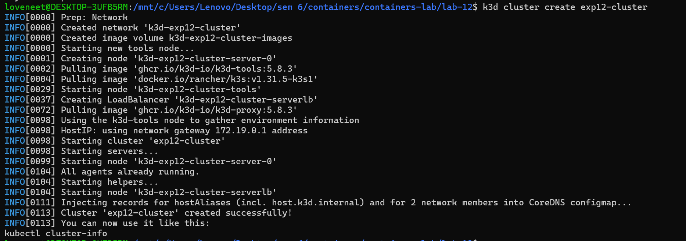

---

###  Step 2: Verify Cluster

```bash
kubectl cluster-info
kubectl get nodes
```

📸 Screenshot:
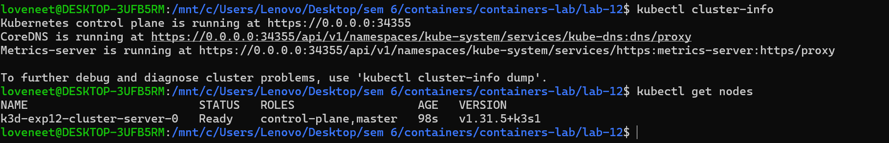

---

###  Step 3: Create Deployment YAML

```bash
nano wordpress-deployment.yaml
```

```yaml
apiVersion: apps/v1
kind: Deployment
metadata:
  name: wordpress
spec:
  replicas: 2
  selector:
    matchLabels:
      app: wordpress
  template:
    metadata:
      labels:
        app: wordpress
    spec:
      containers:
      - name: wordpress
        image: wordpress:latest
        ports:
        - containerPort: 80
```

📸 Screenshot:
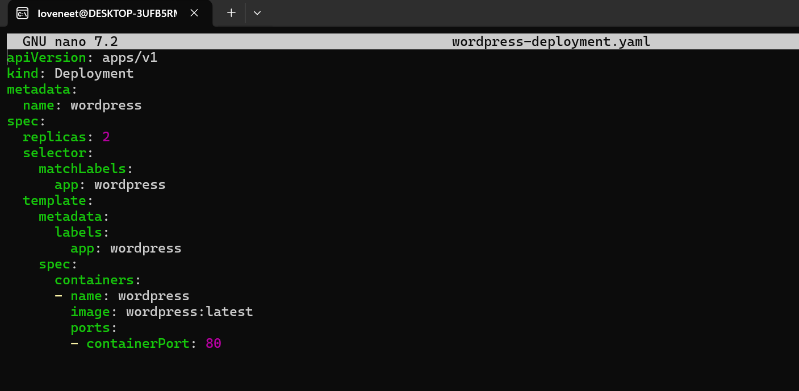

---

###  Step 4: Apply Deployment

```bash
kubectl apply -f wordpress-deployment.yaml
```

📸 Screenshot:
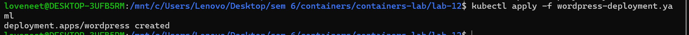

---

###  Step 5: Check Pods

```bash
kubectl get pods
```

📸 Screenshot:
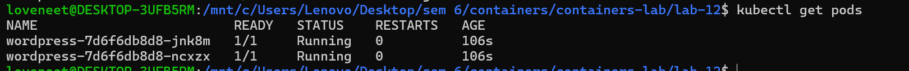

---

###  Step 6: Create Service YAML

```bash
nano wordpress-service.yaml
```

```yaml
apiVersion: v1
kind: Service
metadata:
  name: wordpress-service
spec:
  type: NodePort
  selector:
    app: wordpress
  ports:
    - port: 80
      targetPort: 80
      nodePort: 30007
```

📸 Screenshot:
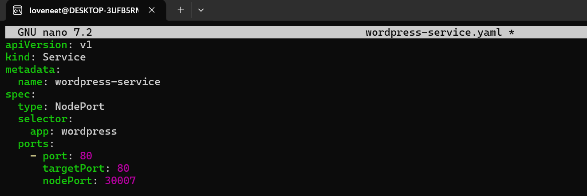

---

###  Step 7: Apply Service

```bash
kubectl apply -f wordpress-service.yaml
```

📸 Screenshot:
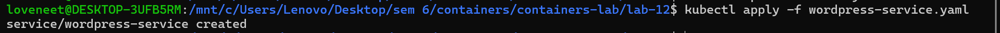

---

###  Step 8: Check Service

```bash
kubectl get svc
```

📸 Screenshot:
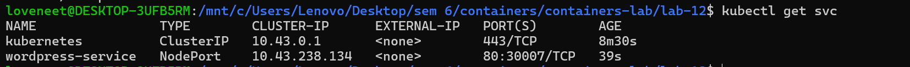

---

###  Step 9: Access Application

```bash
kubectl port-forward service/wordpress-service 8080:80
```

Open in browser:
👉 http://localhost:8080

📸 Screenshot:
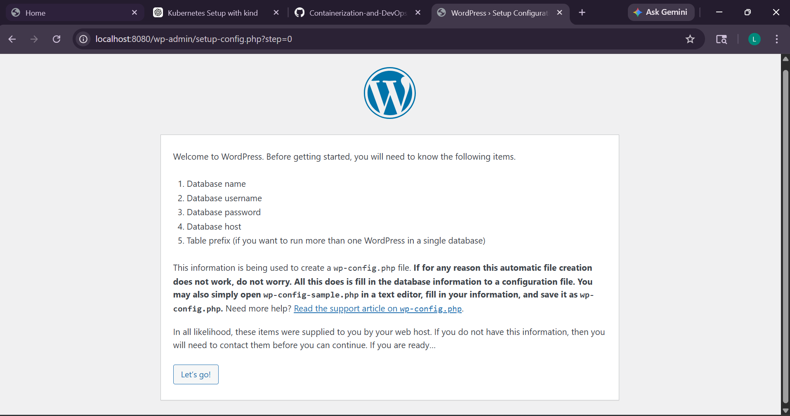

---

###  Step 10: Scaling

```bash
kubectl scale deployment wordpress --replicas=4
kubectl get pods
```

📸 Screenshot:
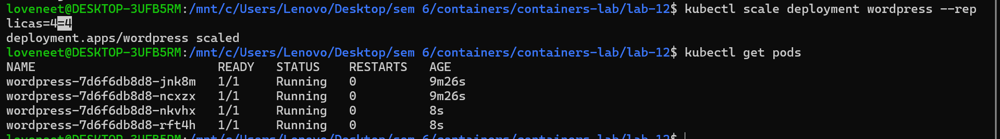

---

###  Step 11: Self-Healing

```bash
kubectl get pods
kubectl delete pod <pod-name>
kubectl get pods
```

📸 Screenshot:
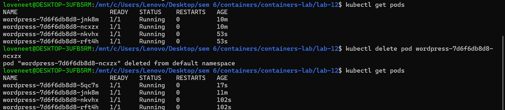

---

## 🔍 Observations

* Pods were created successfully using Deployment
* Service exposed the application
* Application was accessible in browser
* Scaling increased number of pods
* Self-healing recreated deleted pods automatically

---

##  Conclusion

* Kubernetes simplifies container orchestration
* Deployment ensures availability of application
* Services provide external access
* Scaling improves performance
* Self-healing increases reliability

---

##  Viva Questions

### Q1. What is Kubernetes?

Kubernetes is a container orchestration tool used to automate deployment and management of containers.

### Q2. What is a Pod?

A pod is the smallest unit in Kubernetes that runs containers.

### Q3. What is Deployment?

A deployment manages and maintains a set of pods.

### Q4. What is Service?

A service exposes the application to users.

### Q5. What is scaling?

Scaling means increasing or decreasing number of pods.

---

##  Key Learning

* Learned Kubernetes architecture
* Performed deployment and service exposure
* Understood scaling and self-healing
* Used k3d for lightweight Kubernetes setup

---
