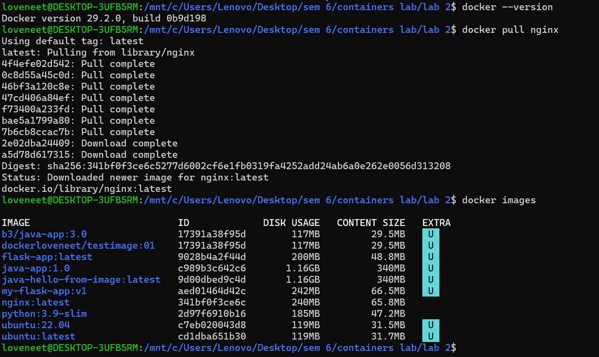
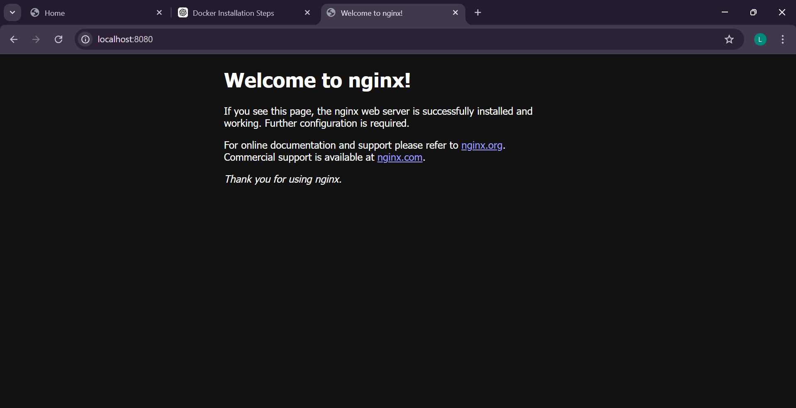
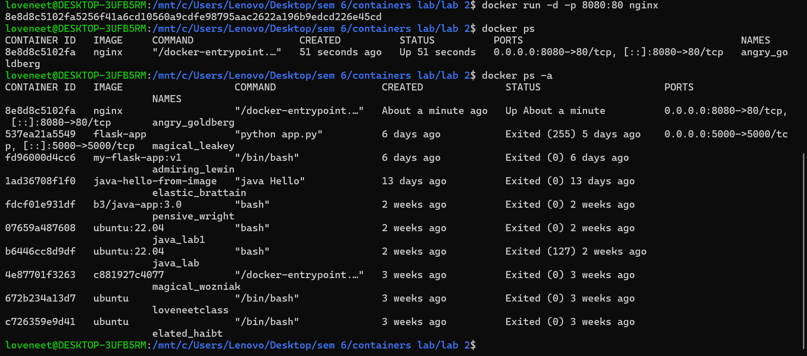
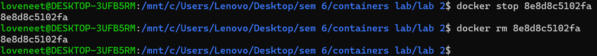
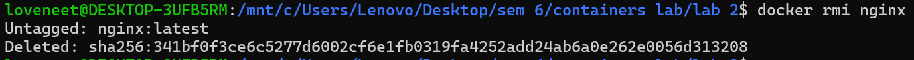

# Experiment 2

## Docker Installation, Configuration, and Running Images

---

## 🎯 Objective

* Pull Docker images
* Run containers
* Manage container lifecycle

---

## 🛠️ Requirements

* Docker installed on system
* Internet connection

---

## 📌 Procedure

### Step 1: Pull Docker Image

```bash
docker pull nginx
```

📸 Screenshot:


---

### Step 2: Run Container with Port Mapping

```bash
docker run -d -p 8080:80 nginx
```

📸 Screenshot:


---

### Step 3: Verify Running Containers

```bash
docker ps
```

📸 Screenshot:


---

### Step 4: Stop and Remove Container

```bash
docker stop <container_id>
docker rm <container_id>
```

📸 Screenshot:


---

### Step 5: Remove Image

```bash
docker rmi nginx
```

📸 Screenshot:


---

## ✅ Result

Docker images were successfully pulled, containers were executed, and lifecycle commands were performed.

---

## 📚 References

* https://docs.docker.com/get-started/
* https://docs.docker.com/engine/reference/commandline/docker/
* https://hub.docker.com/

---

## 🧾 Conclusion

This experiment demonstrated Docker installation and usage.
Docker enables lightweight containerization, faster deployment, and efficient resource utilization.
Containers are ideal for microservices, while virtual machines provide stronger isolation.

---
