**Name:** Loveneet Rulhan 
**SAP ID:** 500123392
**Batch:** B3 (CCVT)

# 🧪 Experiment 4: Docker Essentials

## 🎯 Aim

To understand Docker basics including Dockerfile, images, containers, multi-stage builds, and Docker Hub.

---

## 🔹 Step 1: Create Project Directory

```bash
mkdir flask-app
cd flask-app
```

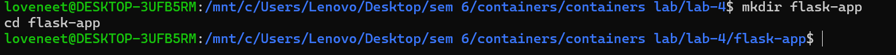

---

## 🔹 Step 2: Create Flask Application

```bash
nano app.py
```

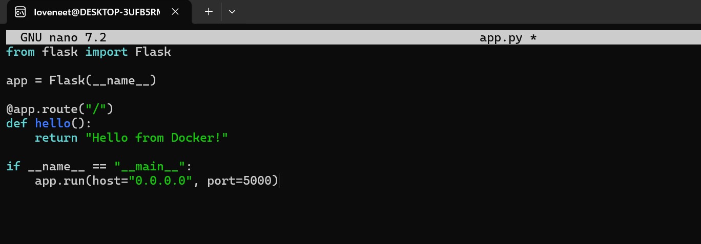

---

## 🔹 Step 3: Create requirements.txt

```bash
nano requirements.txt
```

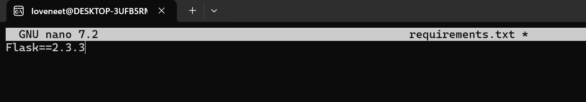

---

## 🔹 Step 4: Create Dockerfile

```bash
nano Dockerfile
```

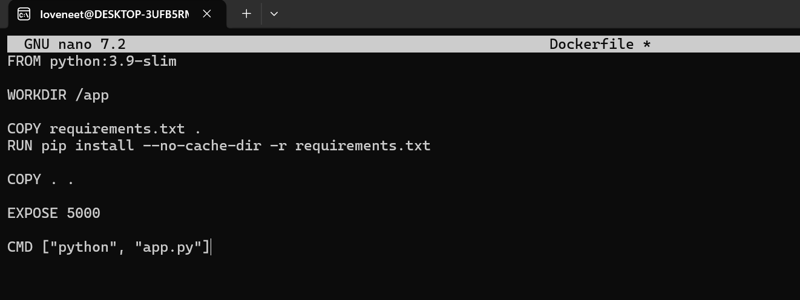

---

## 🔹 Step 5: Verify Files

```bash
ls
```

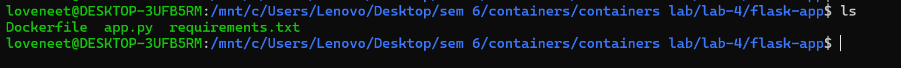

---

## 🔹 Step 6: Build Docker Image

```bash
docker build -t flask-app .
```

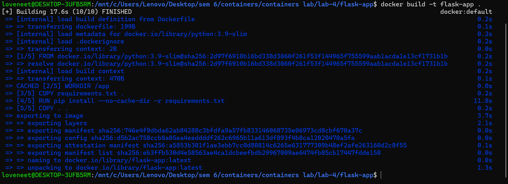

---

## 🔹 Step 7: Run Container

```bash
docker run -p 5000:5000 flask-app
```

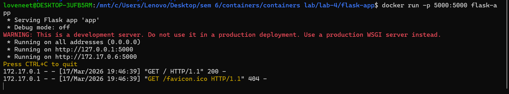

---

## 🔹 Step 8: Output


---

## 🔹 Step 9: Create .dockerignore

```bash
nano .dockerignore
```

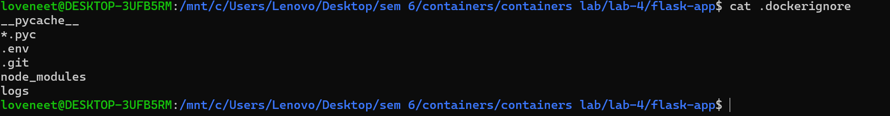

---

## 🔹 Step 10: Docker Images

```bash
docker images
```

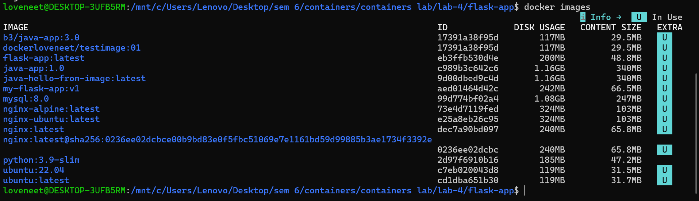

---

## 🔹 Step 11: Tag Image

```bash
docker tag flask-app <your-username>/flask-app:1.0
```

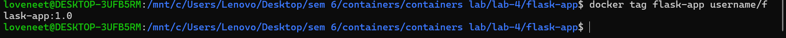

---

## 🔹 Step 12: Inspect Image

```bash
docker inspect flask-app
```

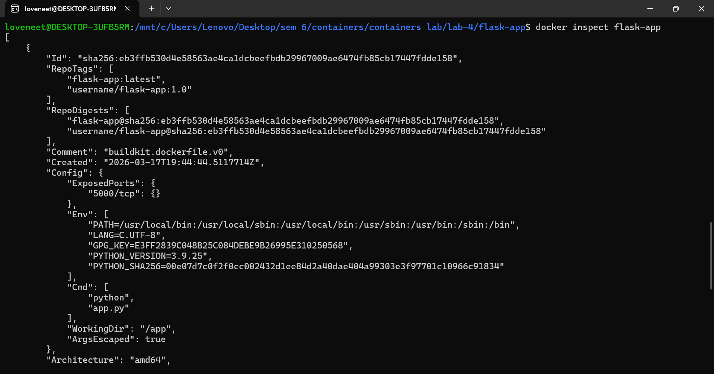

---

## 🔹 Step 13: Run in Background

```bash
docker run -d -p 5000:5000 --name flask-container flask-app
```

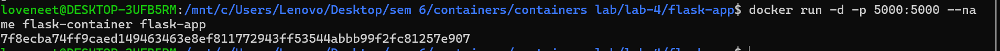

---

## 🔹 Step 14: Running Containers

```bash
docker ps
```

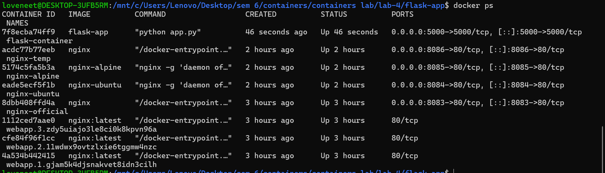

---

## 🔹 Step 15: Logs

```bash
docker logs flask-container
```

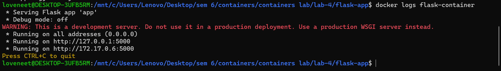

---

## 🔹 Step 16: Stop Container

```bash
docker stop flask-container
```


---

## 🔹 Step 17: Multi-stage Dockerfile

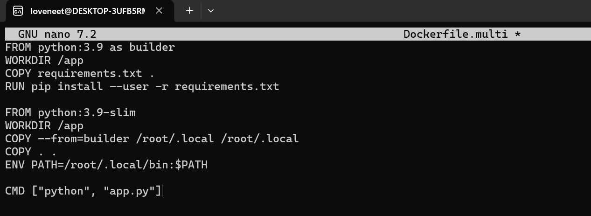

---

## 🔹 Step 18: Build Multi-stage

```bash
docker build -f Dockerfile.multi -t flask-multi .
```

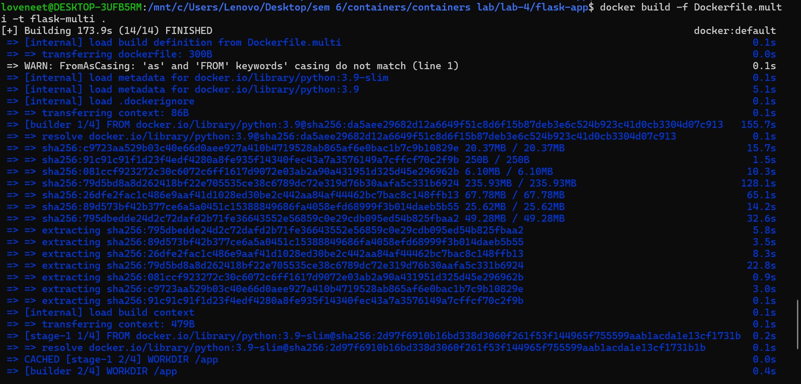

---

## 🔹 Step 19: Compare Images

```bash
docker images
```

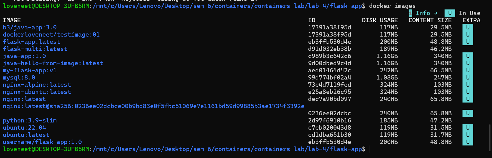

---

## 🔹 Step 20: Login

```bash
docker login
```

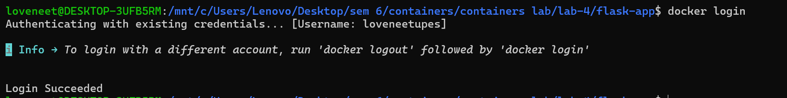

---

## 🔹 Step 21: Tag for Hub

```bash
docker tag flask-app <your-username>/flask-app:latest
```

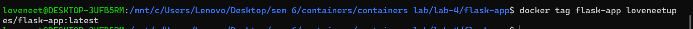

---

## 🔹 Step 22: Push Image

```bash
docker push <your-username>/flask-app:latest
```

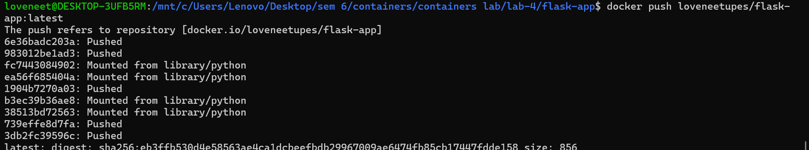

---

## 🧾 Result

The experiment was successfully completed. Docker images were created, containers were run, and images were pushed to Docker Hub.

---

## 🧾 Conclusion

Docker simplifies deployment and improves portability and scalability.
