# Experiment 5: Docker - Volumes, Environment Variables, Monitoring & Networks

---

## 🔹 Objective

To understand Docker volumes, environment variables, monitoring, networking, and deploy a multi-container application using Docker.

---

#  Part 1: Docker Volumes

## 🔸 Anonymous Volume

### Commands:

```bash
docker run -d -v /app/data --name web1 nginx
docker exec web1 sh -c "echo hello > /app/data/file.txt"
docker exec web1 cat /app/data/file.txt
```

### Output:

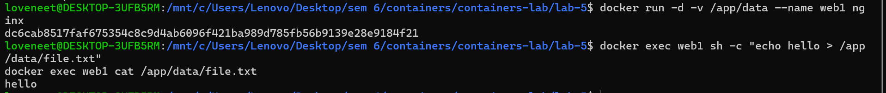

### Explanation:

Anonymous volumes store data inside Docker-managed storage and persist even after container deletion.

---

## 🔸 Named Volume

### Commands:

```bash
docker volume create mydata
docker run -d -v mydata:/app/data --name web2 nginx
docker exec web2 sh -c "echo persistent > /app/data/data.txt"
docker exec web2 cat /app/data/data.txt
```

### Output:


### Explanation:

Named volumes allow better management of persistent data using a specific volume name.

---

## 🔸 Bind Mount

### Commands:

```bash
mkdir ~/mydata
echo "hello from host" > ~/mydata/host.txt

docker run -d -v ~/mydata:/app/data --name web3 nginx
docker exec web3 cat /app/data/host.txt
```

### Output:

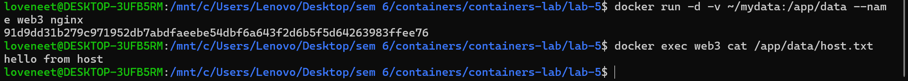

### Explanation:

Bind mounts link host directory with container directory allowing direct file sharing.

---

## 🔸 MySQL Persistent Storage

### Commands:

```bash
docker volume create mysql_data

docker run -d \
  --name mysql1 \
  -e MYSQL_ROOT_PASSWORD=secret \
  -v mysql_data:/var/lib/mysql \
  mysql
```

### Verify:

```bash
docker exec -it mysql1 mysql -uroot -psecret
```

```sql
CREATE DATABASE labdb;
SHOW DATABASES;
```

### Output:

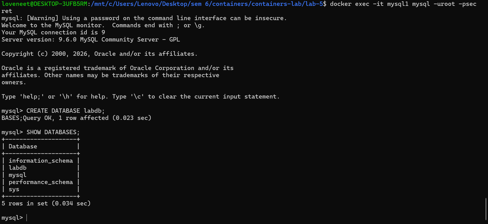

### Explanation:

Data is stored in Docker volume (`mysql_data`) ensuring persistence even after container removal.

---

#  Part 2: Environment Variables

### Commands:

```bash
echo "APP_ENV=prod" > .env
echo "DEBUG=false" >> .env

docker run -d --env-file .env --name envtest nginx
docker exec envtest env
```

### Output:

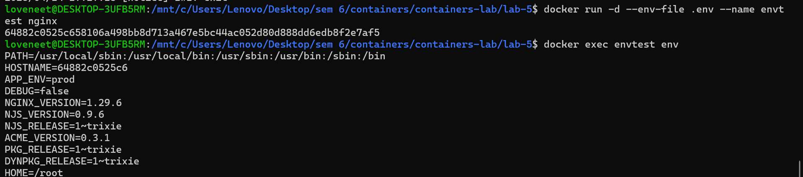

### Explanation:

Environment variables were successfully passed to the container using `.env` file.

---

#  Part 3: Docker Monitoring

### Commands:

```bash
docker ps
docker stats
docker top envtest
docker logs envtest
docker inspect envtest
docker events
```

### Output:

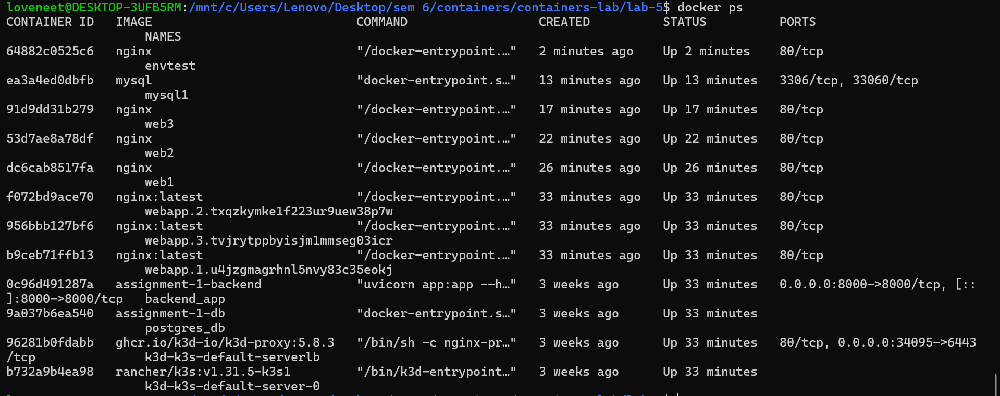
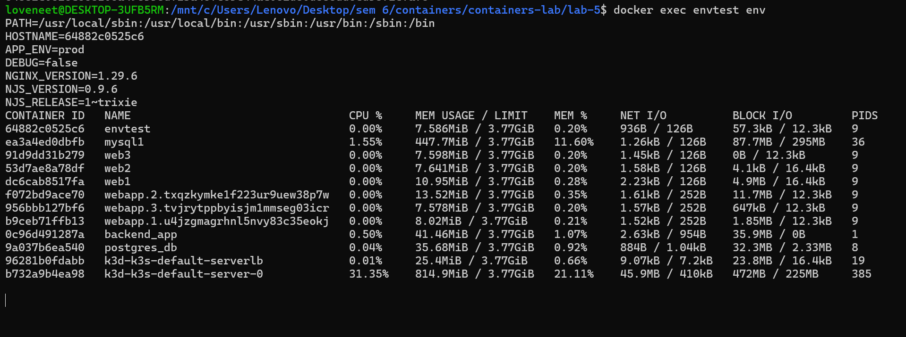
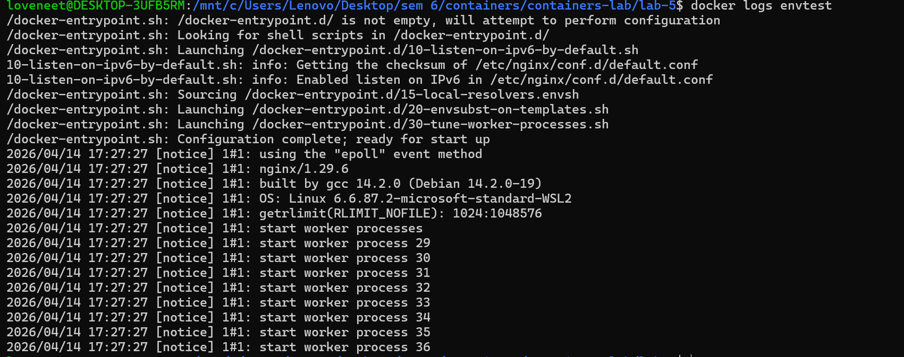
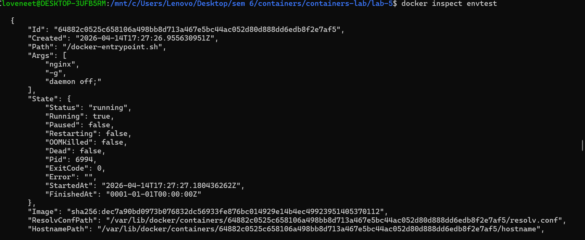
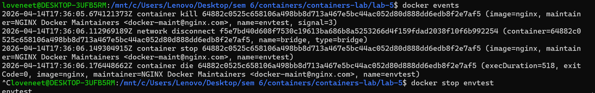

### Explanation:

Docker monitoring commands help track container performance, logs, processes, and system events.

---

#  Part 4: Docker Networks

### Commands:

```bash
docker network create app-network

docker run -d --name app1 --network app-network nginx
docker run -d --name app2 --network app-network nginx

docker exec -it app1 ping app2
```

### Output:

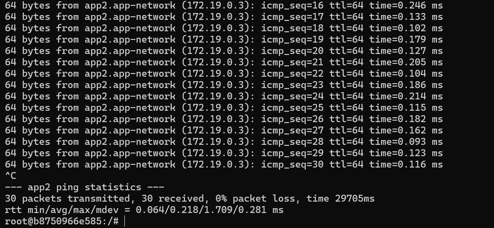

### Explanation:

Containers connected to the same network can communicate using container names due to Docker DNS.

---

#  Part 5: Multi-Container Application (WordPress + MySQL)

### Commands:

```bash
docker network create wp-network

docker run -d \
  --name mysql-db \
  --network wp-network \
  -e MYSQL_ROOT_PASSWORD=secret \
  -e MYSQL_DATABASE=wordpress \
  mysql:5.7

docker run -d \
  --name wordpress \
  --network wp-network \
  -p 8082:80 \
  -e WORDPRESS_DB_HOST=mysql-db \
  -e WORDPRESS_DB_USER=root \
  -e WORDPRESS_DB_PASSWORD=secret \
  wordpress
```

### Output:

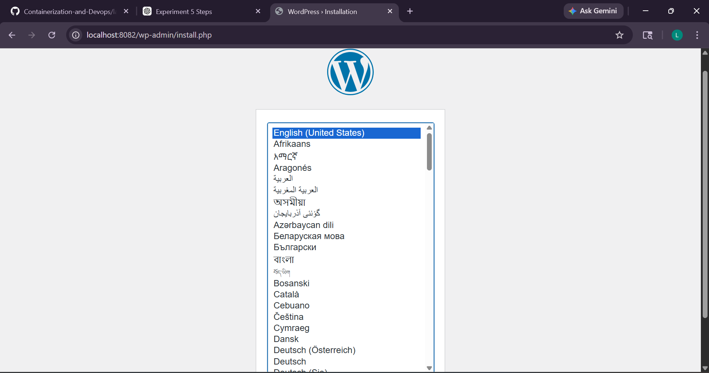

### Explanation:

A multi-container application was deployed where WordPress connects to MySQL using Docker networking.

---


# # Conclusion

In this experiment, we successfully learned:

* Docker volumes for persistent storage
* Environment variables usage
* Container monitoring techniques
* Docker networking
* Multi-container application deployment

Docker simplifies application deployment, improves scalability, and ensures efficient resource management.

---
