# CI/CD Pipeline using Jenkins and Docker

##  Objective

To implement a CI/CD pipeline using Jenkins that builds a Docker image from a GitHub repository and pushes it to Docker Hub.

---

##  Tools Used

* Jenkins
* Docker
* Docker Hub
* GitHub

---

##  Theory

Jenkins is an open-source automation server used for Continuous Integration and Continuous Deployment (CI/CD). It automates the process of building, testing, and deploying applications.

Docker is a containerization platform that packages applications along with their dependencies into containers, ensuring consistency across environments.

In this experiment, Jenkins is integrated with Docker to automatically build and push images from a GitHub repository.

---

##  Steps Performed

### Step 1: Create Docker Compose File

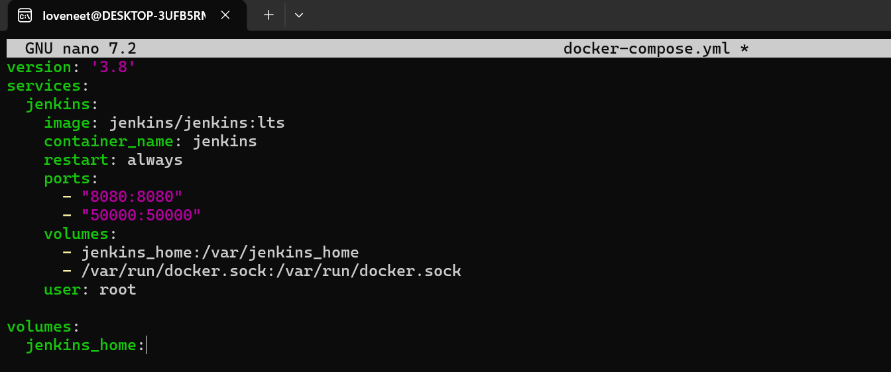

---

### Step 2: Start Jenkins Container

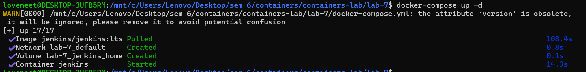

---

### Step 3: Verify Running Container

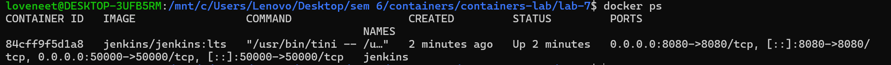

---

### Step 4: Open Jenkins UI

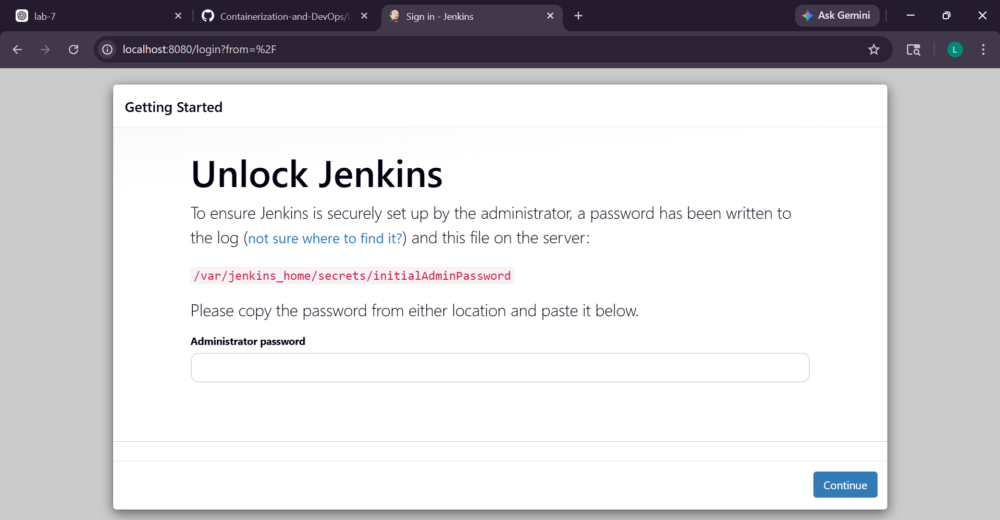

---

### Step 5: Get Admin Password

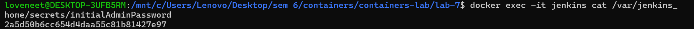

---

### Step 6: Install Plugins


---

### Step 7: Create Jenkins User

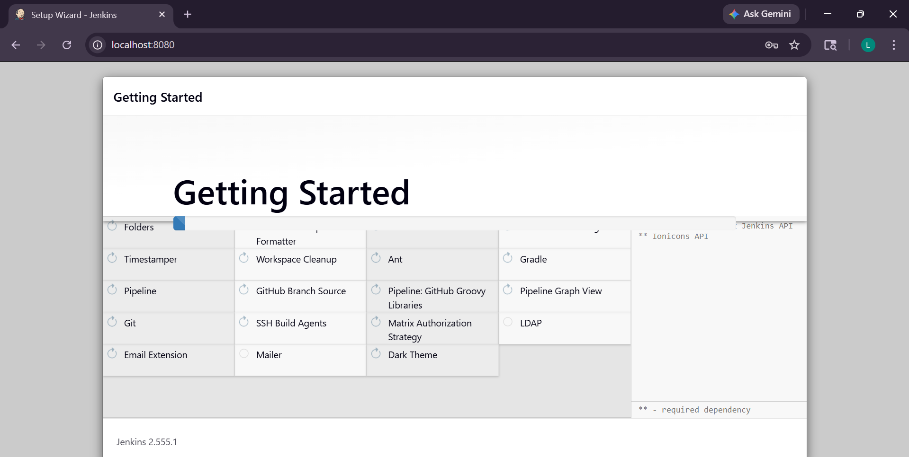

---

### Step 8: Jenkins Dashboard

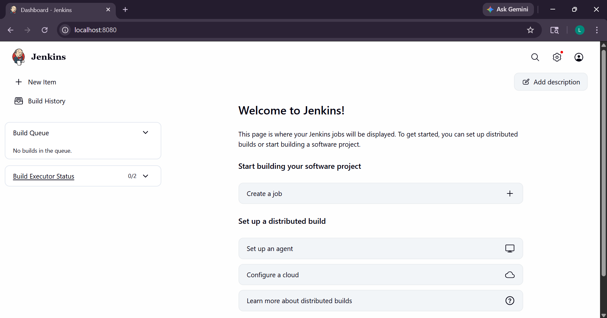

---

### Step 9: Create DockerHub Token

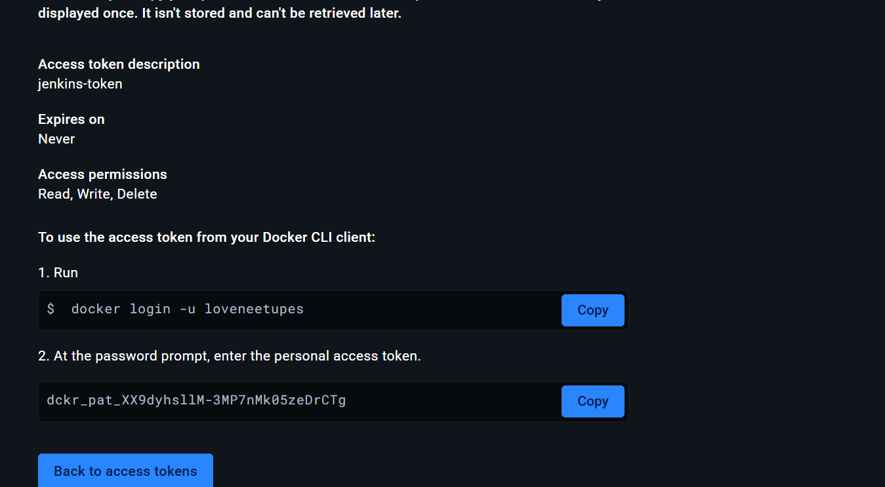

---

### Step 10: Add Credentials in Jenkins

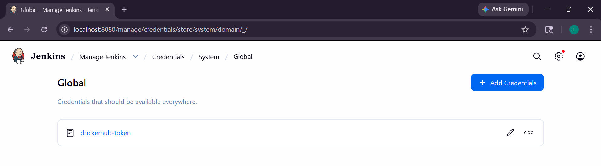

---

### Step 11: Create GitHub Repository

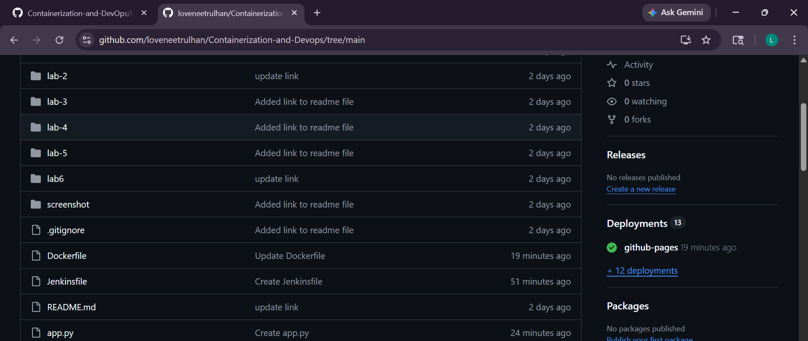

---

### Step 12: Create Pipeline

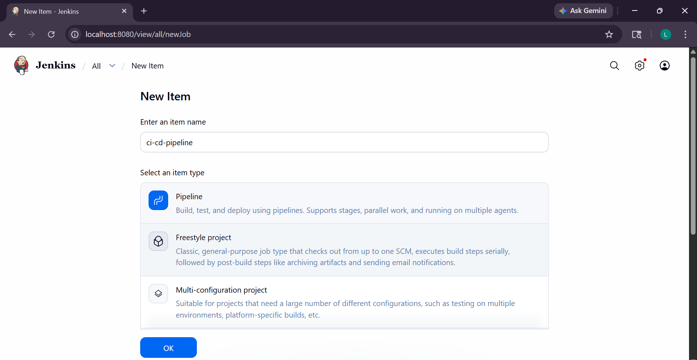

---

### Step 13: Install Docker in Jenkins

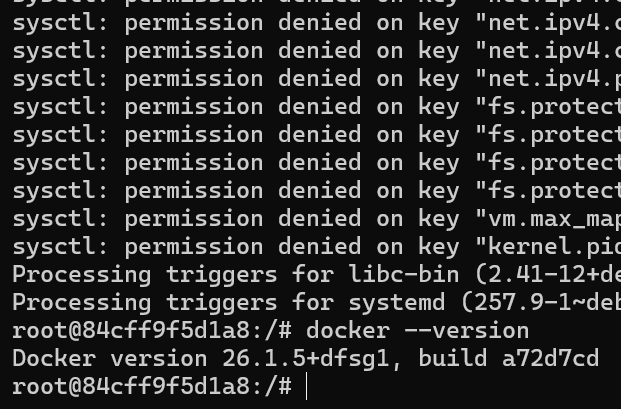

---

### Step 14: Successful Console Output

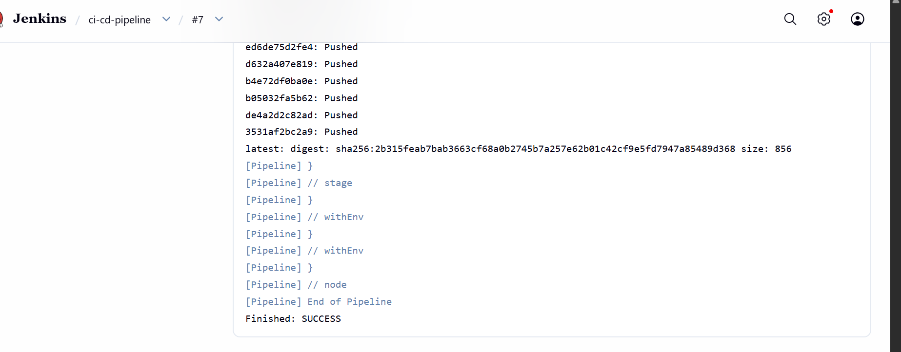

---

##  Jenkinsfile

```groovy
pipeline {
    agent any

    environment {
        IMAGE_NAME = "loveneetupes/myapp"
    }

    stages {
        stage('Clone Source') {
            steps {
                git branch: 'main', url: 'https://github.com/loveneetrulhan/Containerization-and-Devops.git'
            }
        }

        stage('Build Docker Image') {
            steps {
                sh 'docker build -t $IMAGE_NAME:latest .'
            }
        }

        stage('Login to Docker Hub') {
            steps {
                withCredentials([string(credentialsId: 'dockerhub-token', variable: 'DOCKER_TOKEN')]) {
                    sh 'echo $DOCKER_TOKEN | docker login -u loveneetupes --password-stdin'
                }
            }
        }

        stage('Push to Docker Hub') {
            steps {
                sh 'docker push $IMAGE_NAME:latest'
            }
        }
    }
}
```

---

##  Dockerfile

```dockerfile
FROM python:3.10-slim

WORKDIR /app

COPY . .

RUN pip install --upgrade pip
RUN pip install flask --default-timeout=100

EXPOSE 80

CMD ["python", "app.py"]
```

---

##  Conclusion

This experiment demonstrated the implementation of a CI/CD pipeline using Jenkins and Docker. Jenkins was successfully configured to pull code from GitHub, build a Docker image, authenticate with Docker Hub, and push the image automatically. This shows how DevOps tools can automate the software delivery process efficiently.

---

##  Viva Questions

**Q1. What is Jenkins?**
Jenkins is an automation tool used for CI/CD.

**Q2. What is Docker?**
Docker is a containerization platform.

**Q3. What is CI/CD?**
Continuous Integration and Continuous Deployment.

**Q4. What is Jenkinsfile?**
A pipeline script written in Groovy.

**Q5. Why use DockerHub token?**
For secure authentication instead of password.

---
