#  Experiment 9: Ansible with Docker

---

##  Objective

The objective of this experiment is to understand and implement **configuration management and automation using Ansible**.
We aim to automate the configuration of a Docker container by setting up SSH access and executing tasks using Ansible playbooks.

---

##  Theory

### 🔹 What is Ansible?

Ansible is an **open-source automation tool** used for:

* Configuration management
* Application deployment
* Task automation

It works in an **agentless manner**, meaning no software is required on the target system. It uses **SSH protocol** for communication.

---

### 🔹 Key Features

* Agentless architecture
* Uses SSH for communication
* YAML-based playbooks
* Idempotent (safe to run multiple times)

---

### 🔹 Important Concepts

* **Control Node** → System where Ansible runs
* **Managed Node** → Target system (Docker container)
* **Inventory** → List of systems
* **Playbook** → YAML file containing tasks

---

## 🛠️ Tools Used

* Docker
* Ansible
* Ubuntu / WSL
* SSH

---

## 🚀 Steps with Screenshots

---

### 🔹 Step 1: Install Ansible

Installed Ansible on the control machine and verified installation.

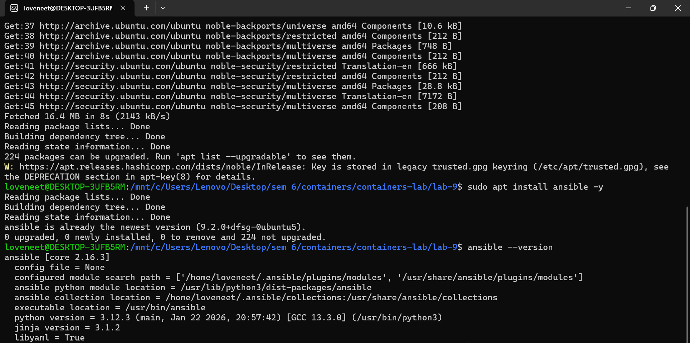

---

### 🔹 Step 2: Ansible Ping Test
Performed a ping test to check if Ansible is working correctly.

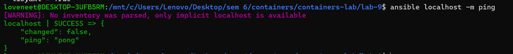

---

### 🔹 Step 3: Generate SSH Key
Created SSH key pair to enable secure communication between systems.

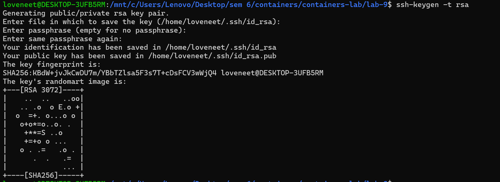

---

### 🔹 Step 4: Create Dockerfile
Created a Dockerfile to build an Ubuntu container with:

- SSH server 
-  Python (required for Ansible)

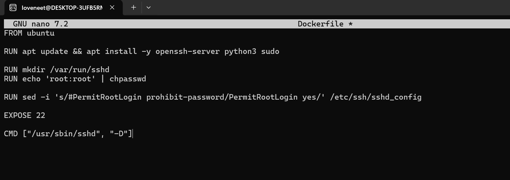

---

### 🔹 Step 5: Build Docker Image.
Built a Docker image using the Dockerfile.

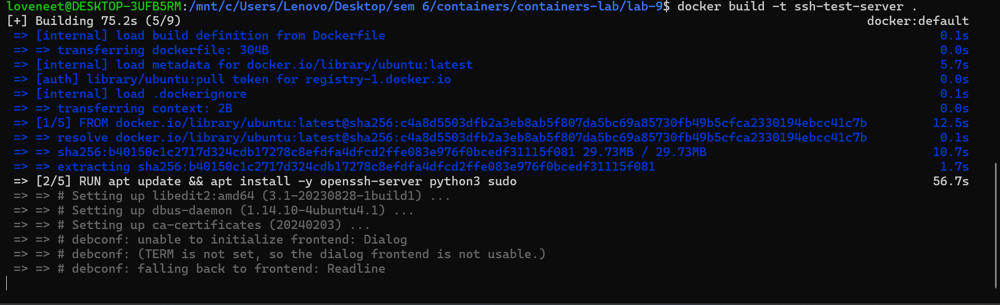

---

### 🔹 Step 6: Run Docker Container
Started the container and mapped port 2222 for SSH access.

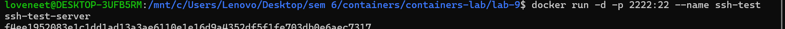

---

### 🔹 Step 7: Get Container IP
Retrieved container IP address (optional step).

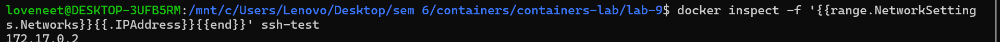

---

### 🔹 Step 8: SSH Login (Password)
Connected to container using password-based authentication.

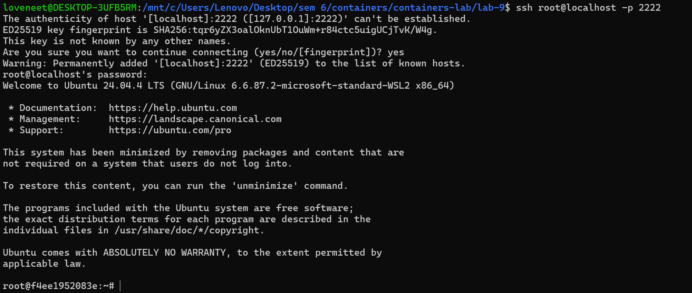

---

### 🔹 Step 9: SSH Key Authentication
Enabled passwordless login using SSH keys.

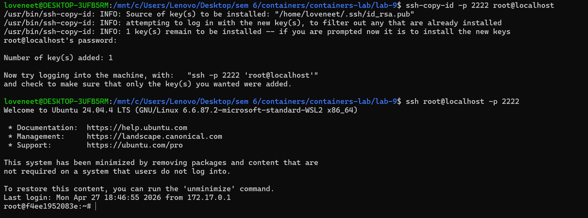

---

### 🔹 Step 10: Create Inventory File
Defined the target container in Ansible inventory. 

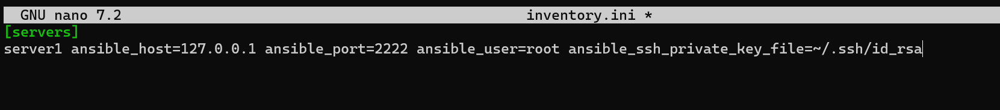

---

### 🔹 Step 11: Ansible Connectivity Test
Verified connection between Ansible and container using ping module.

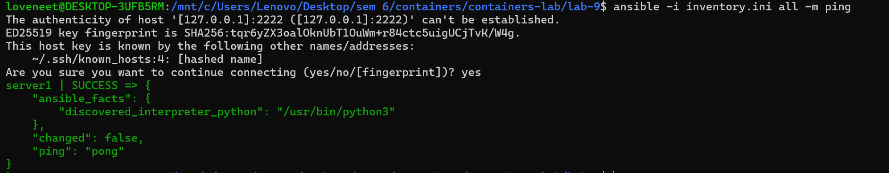

---

### 🔹 Step 12: Create Playbook
Created a YAML playbook to:

- Update packages
- Install Nginx
- Create a file inside container

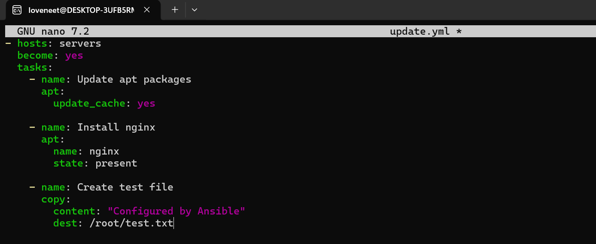

---

### 🔹 Step 13: Run Playbook
Executed playbook to automate configuration tasks.

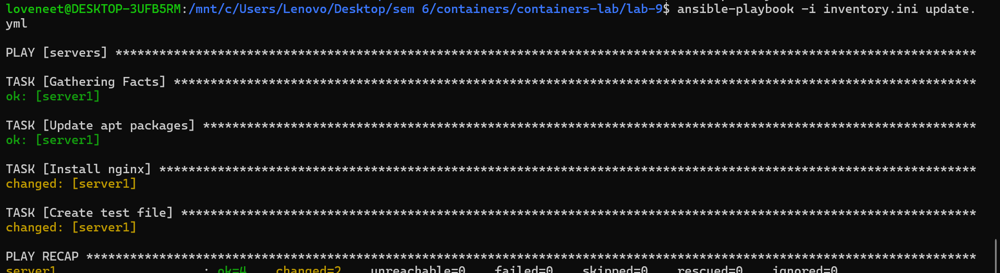

---

### 🔹 Step 14: Verify Output
Checked inside container to confirm:

- Nginx installation
- File creation

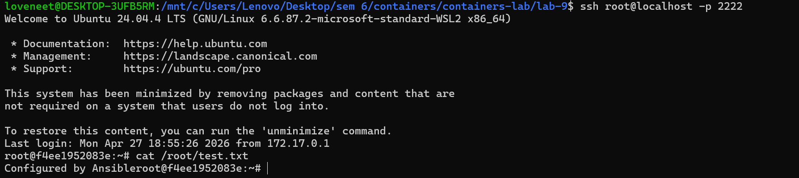

---

### 🔹 Step 15: Cleanup
Stopped and removed the Docker container.

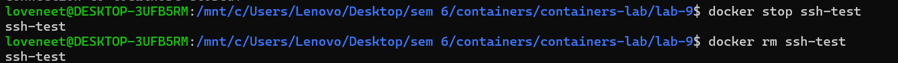

---

##  Result

Successfully automated the configuration of a Docker container using Ansible.
Tasks like package installation and file creation were executed automatically.

---

##  Conclusion

This experiment demonstrated how Ansible simplifies system administration by automating tasks.
It also showed how Docker can be used as a testing environment for automation tools.

---

---
