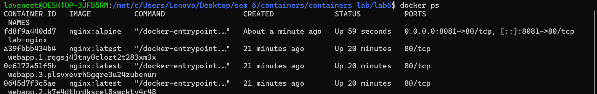
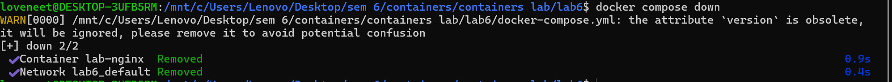
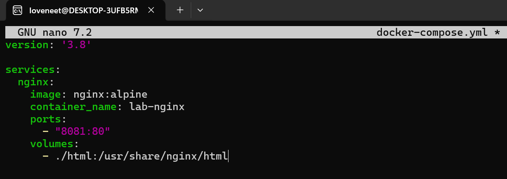
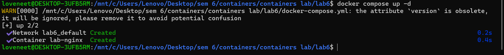
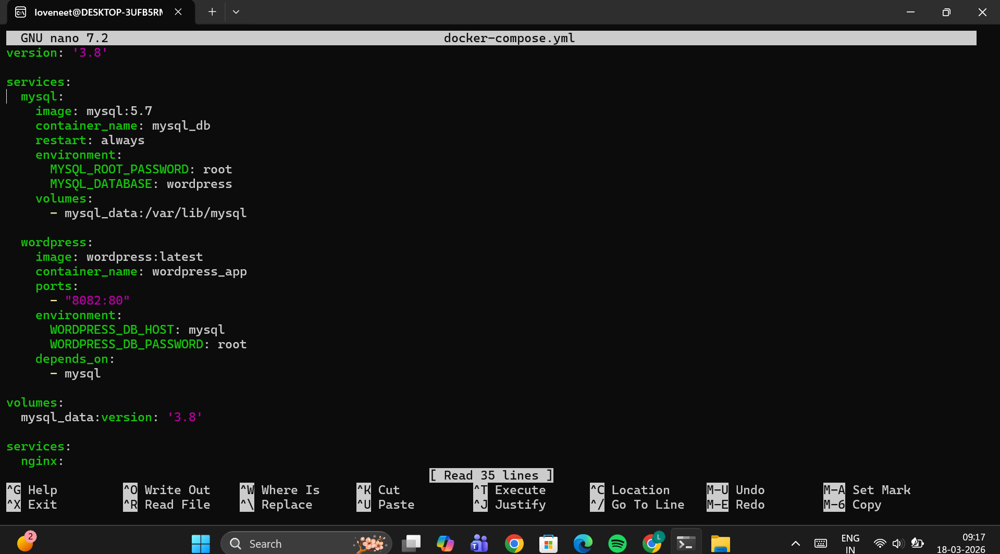
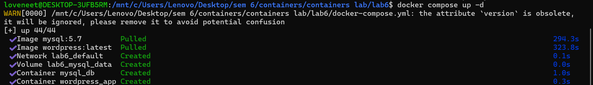
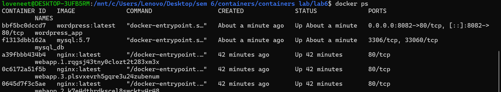
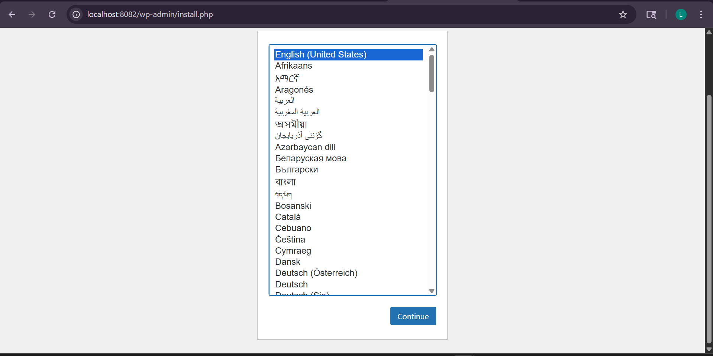
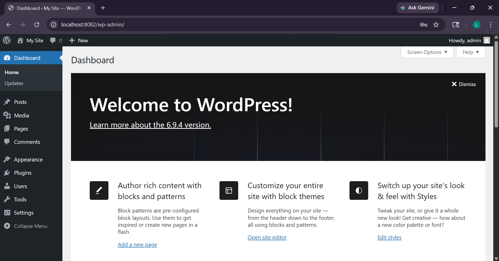
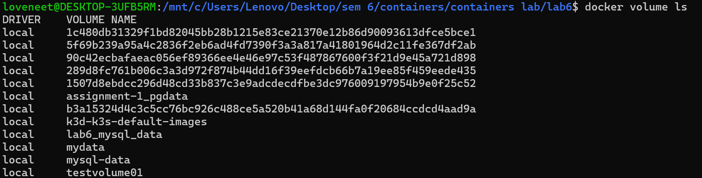

"# 🧪 Experiment 6: Docker Run vs Docker Compose

---

## 🎯 Aim

To compare Docker Run and Docker Compose and deploy applications using both methods.

---

# 🔹 PART A: Single Container (Nginx)

## Step 1: Run using Docker Run

```bash
docker run -d -p 8081:80 --name mynginx nginx:alpine
```

📸 Screenshot


---

## Step 2: Verify

```bash
docker ps
```

📸 Screenshot


---

## Step 3: Stop Container

```bash
docker stop mynginx
docker rm mynginx
```

📸 Screenshot


---

# 🔹 PART B: Using Docker Compose (Nginx)

## Step 1: Create docker-compose.yml

📸 Screenshot


---

## Step 2: Run

```bash
docker compose up -d
```

📸 Screenshot


---

## Step 3: Verify

```bash
docker compose ps
```

📸 Screenshot


---

## Step 4: Browser Output

📸 Screenshot


---

## Step 5: Stop

```bash
docker compose down
```

📸 Screenshot


---

# 🔹 PART C: WordPress + MySQL (Docker Compose)

## Step 1: Create Compose File

📸 Screenshot


---

## Step 2: WordPress YAML

📸 Screenshot


---

## Step 3: Run Containers

```bash
docker compose up -d
```

📸 Screenshot


---

## Step 4: Verify

```bash
docker ps
```

📸 Screenshot


---

## Step 5: WordPress Setup Page

📸 Screenshot


---

## Step 6: WordPress Dashboard

📸 Screenshot


---

## Step 7: Volumes

```bash
docker volume ls
```

📸 Screenshot


---

# 🧾 Result

The experiment was successfully completed. Docker Run and Docker Compose were used to deploy both single-container and multi-container applications.

---

# 🧾 Conclusion

Docker Compose is more efficient and easier to manage than Docker Run, especially for multi-container applications like WordPress with MySQL.

---
